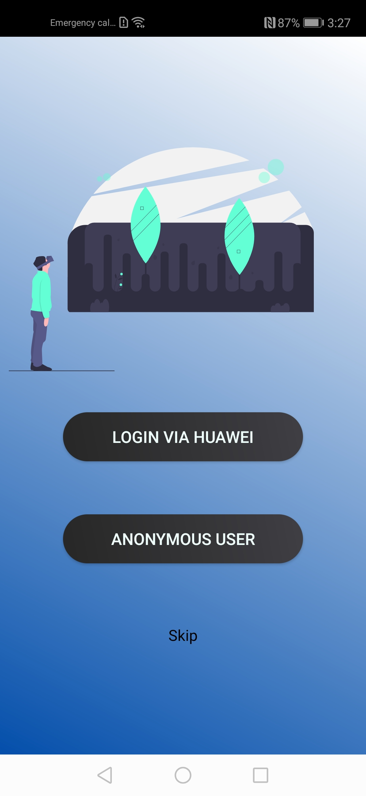
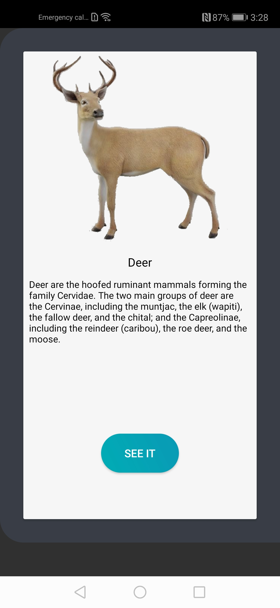
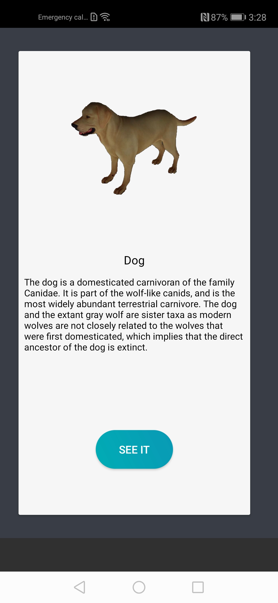
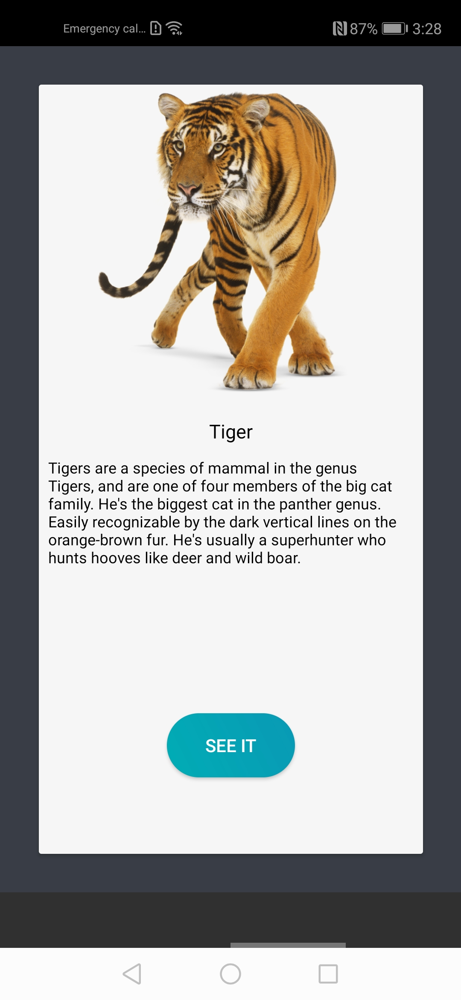
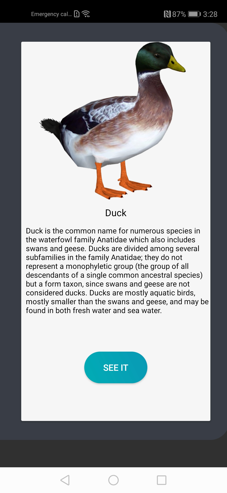
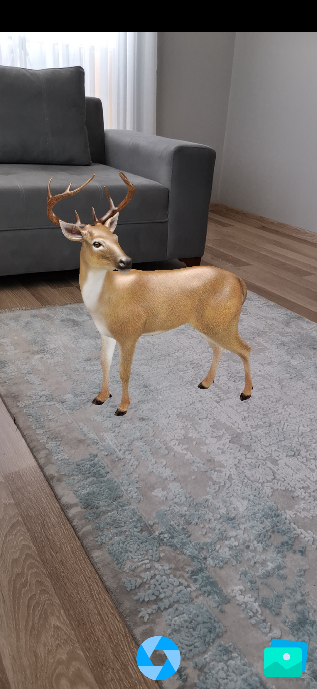
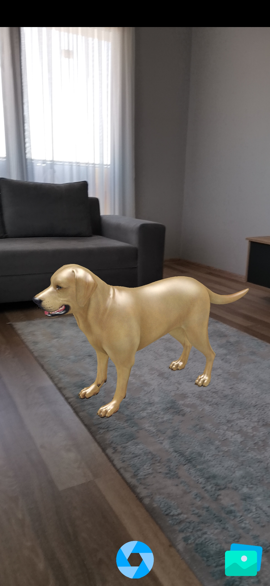
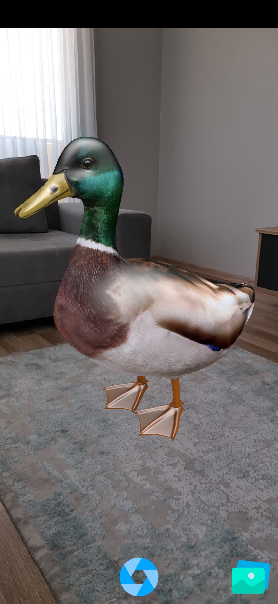
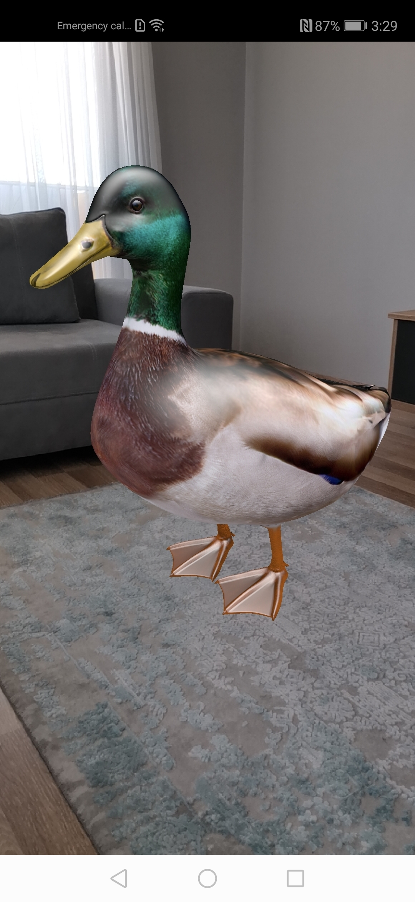
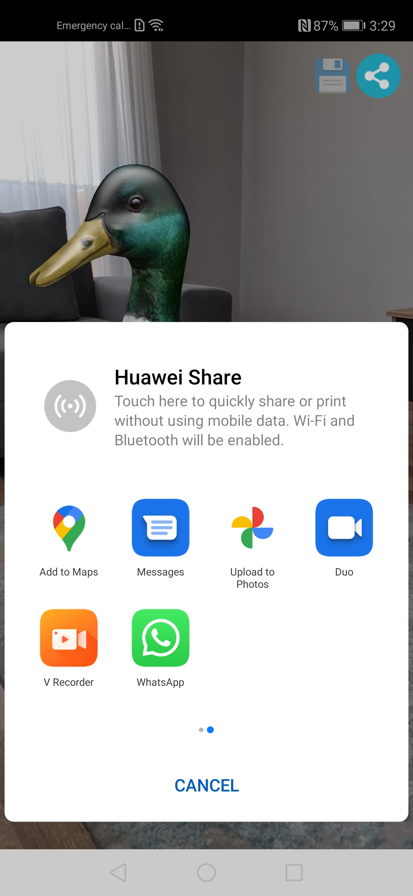

.
# HiAnimals

## :notebook_with_decorative_cover: Introduction 
AnimalsIntroduction is a reference AR app created with HMS kits. You can use it on your phones running with the Android-based HMS service. It was developed with the Java language.
This app allows you to visualize some animals as AR.

## :iphone: Screenshots
.
.
.
.
.
.
.
.
.
.

##  :question: Before You Start

* You need to agconnect-services.json for run this project correctly. 
* If you don't have a Huawei Developer account check this document for create;  
https://developer.huawei.com/consumer/en/doc/start/10104 
* Open your Android project and find Debug FingerPrint (SHA256) with follow this steps; 
View -> Tool Windows -> Gradle -> Tasks -> Android -> signingReport 
* Login to Huawei Developer Console (https://developer.huawei.com/consumer/en/console) 
* If you don't have any app check this document for create;  
https://developer.huawei.com/consumer/en/doc/distribution/app/agc-create_app 
* Add SHA256 FingerPrint into your app with follow this steps on Huawei Console;  
My Apps -> Select App -> Project Settings 
* Make enable necessary SDKs with follow this steps; 
My Apps -> Select App -> Project Settings -> Manage APIs 
* For this project you have to set enable Account Kit, Auth Service, Push Kit, Cloud DB 
* Than go again Project Settings page and click "agconnect-services.json" button for download json file. 
* Move to json file in base "app" folder that under your android project.  
(https://developer.huawei.com/consumer/en/doc/development/HMS-Guides/69407812#h1-1577692046342) 
* Go to app level gradle file and change application id of your android project. It must be same with app id on AppGallery console you defined.

##  :information_desk_person: Things to Know

* Since the application is written entirely in HMS, you must have HMS Core installed on your device. 
* For Android devices without HMS Core, you can download the latest version from this link; https://tik.to/9l6 
* Also your phone should support Huawei AR Engine. You can reach supported device list [here] (https://developer.huawei.com/consumer/en/doc/HMSCore-Guides-V5/introduction-0000001050130900-V5#EN-US_TOPIC_0000001050130900__section260mcpsimp)
.  

## :milky_way: Features

* Sign up & Sign In with Huawei Id 
* Select an animal and visualize it as AR 
* Take a photo with selected animal 
* Save photos to the local or cloud and get it back 
* Share taken photos. 

## :rocket: Kits

* [Huawei Account Kit] (https://developer.huawei.com/consumer/en/doc/development/HMSCore-Guides/introduction-0000001050048870) 
* [Huawei AR Engine] (https://developer.huawei.com/consumer/en/doc/development/HMSCore-Guides/introduction-0000001050130900) 
* [Huawei Cloud DB] (https://developer.huawei.com/consumer/en/doc/development/AppGallery-connect-Guides/clouddb-quick_start_overview) 
* [Huawei Ads Kit] (https://developer.huawei.com/consumer/en/doc/development/HMSCore-Guides/publisher-service-introduction-0000001050064960) 
* [Huawei Push Kit] (https://developer.huawei.com/consumer/en/doc/development/HMSCore-Guides/service-introduction-0000001050040060) 

## :link: Useful Links 
* [Huawei Developers Medium Page EN](https://medium.com/huawei-developers)
* [Huawei Developers Medium Page TR](https://medium.com/huawei-developers-tr) 
* [Huawei Developers Forum](https://forums.developer.huawei.com/forumPortal/en/home)
